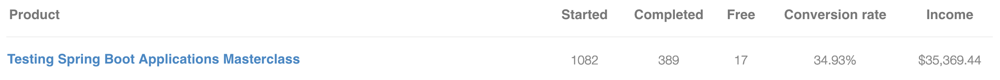

Learnings From Selling My First Paid Online Course

How Much I Made After One Year Selling My First Online Course

How I Made $34674 from Selling My First Online Course

--

Structure: Explain the strategy and plan and then learnings & tips

It's been a year since I've launched my first paid online course. There's a lot of things I've learned along the long the way and mistakes I've made. 

This article gives you an in-depth overview about this journey, my technical setup, the way I've planned, recorded, my sales and marketing efforts.

Background: On [my main blog](https://rieckpil.de/) I'm creating content about Java, Testing, Spring Boot and AWS. In August 2020, I launched my first paid online course: the Testing Spring Boot Applications Masterclass. This online course is an in-depth resources for deploying Spring Boot applications with more confidence thanks to an excellent test suite. The course discusses various recipes and trips & tricks to test real-world Spring Boot applications.

DISCLAIMER: Finding out the right tools and software was quite an effort. The marked links (*) are affiliate links. All the linked tools are in use, and I paid the price (mostly time) to figure out which one fits perfect (for me). I get a small cut if you decide to buy them via one of these links.

Let's get started.

## The Initial Strategy

To better understand my journey, let's take a brief look at by content creation history:

Back in November 2017, I published my [first blog article](https://rieckpil.de/summary-of-the-container-conf-2017/). While the following few articles where rather random (both in the topic and timing), I soon established the habit to constantly write about something. Since then, I've been writing articles for a range of topics mainly about Java and its framework ecosystem. Many of the blog posts where the result of my learnings at work or hands-on tutorials that I wish I had found on Google when I learned a new technology (especially Java EE).

At the end of 2019 I reached the milestone of 100 published articles on my site.

After writing `text/plain` for some years, I thought the next natural step is to also create video content.

I gave it a shot and uploaded a [first video on YouTube](https://www.youtube.com/watch?v=GM5ftYM_W90) in May 2019. The audio quality was bad and the video had black bars as I didn't record 16:9. That didn't matter to me at all as I was happy to leave the comfort zone and have _something_ uploaded. I was quite sure that the quality of every upcoming video will improve anyway.

> Perfection is the enemy of progress

With these two content platforms (blog & YouTube) in place, I continued creating content for a variety of topics. There wasn't a clear target audience I wanted to reach. Whenever a topic worth talking about popped up, I sat down and wrote about it. I usually switched frameworks between the articles and hence wasn't targeting a specific set of Java developers. 

In the last two years I naturally discovered my own content niche. I started focussing more on one specific topic instead of serving all Java developers: Testing Java and specifically Spring Boot (a common framework) applications.

The benefit of this niche is that almost nobody talks about testing in their articles. They showcase shiny new features or tools but nearly never tackle the testing part. 

That's quite frustrating if you want to apply their ideas to your project at work. You copy the relevant sections, making sure it compiles, and then hit a road block.

You know ahead that your colleagues will ask you as soon as you want to integrate your code changes: "Where are the (damn) tests?".

After creating some articles for this niche (Testing Java and specifically Spring Boot applications), I discovered that there's almost no online course that teaches this topic in a comprehensive manner and using real-world example.

Everyone can test the `add` method of a `MyCalculator` class. But how to write an end-to-end test for a modern frontend that involves a OIDC login, database access, fetching data from REST API in the background?

In short, I wanted to develop a real-world course application, enhance it with an excellent test suite and talk about it.

And with real-world I mean a sophisticated application that connects to various infrastructure components. This is where testing becomes tricky.

The intent to create an online course and strategically create blog posts around this topic wasn't there from day one. This came somehow naturally.

I strongly believe that as soon as you have the knowledge about the different testing tools & libraries and recipes at hand, testing becomes joyful.

It's the HOW that's important here.

Packed with this mission, I was highly motivated to get this project going. As I haven't done anything similar before, recording everything upfront would be hell of work. 

That's why I decided to use an iterative approach and incrementally create this course while getting feedback early on. #agileDoneRight

## Creating The Course Content

As a first step, I developed the real-world course application up-front. For the application's tech stack, I used React with TypeScript and a Spring Boot Java backend. That should mirror most of today's architectures (SPA connecting to a backend) out there.

To make the setup more advanced, I added Keycloak (identity provider for OIDC), PostgreSQL to store data, a remote REST API, and an AWS service for messaging to the mix. 

In parallel, I started to sketch out the different course modules (module -> chapter -> lesson). Throughout the course I wanted to tackle unit, integration and end-to-end testing. This gave me the natural course structure of starting at the bottom of the testing pyramid with unit testing and then working upwards until we finally write end-to-end tests in the last module.

Once the application was ready, I had already had a rough idea of what I want to showcase and talk about. I ensured to have enough code parts to demonstrate various testing techniques: secured endpoints, message listeners, database access with native queries, plain business logic to verify, etc.

While I could (and maybe should) have written the tests for the application alongside the development, I first wanted to have a working application that falls under the category of real-world and does some non-trivial tasks.

As the goal of the online course was all about testing applications, I did not record the creation of the sample application. At various lessons I explained the relevant code parts and gave an architectural overview at the beginning of the course. The overall application was sophisticated in the setup and yet simple enough to grasp.

Here's a short excerpt of the course application's main use case: Creating book reviews:

(this is an automatically recorded outcome of a end-to-end Java tests)

With my iterative course creation strategy I started with the first milestone to release the first two modules (roughly 15 course lessons). Those two modules were all about getting used to the course application and an introduction to the various unit testing libraries.

This initial goal got me started to outline the first lessons greater detail. I noted down the best practices, tips and pitfalls I wanted to show. I did not plan each an every lesson in detail and rather found a natural position to cut the recorded video. 

Next, I opened my IDE and started developing all the tests that I'll be writing and talking about in the recording. Once finished, I committed the changes to my private GitHub repository and removed the code to the bare skeleton again.

This "dry run" without recording helped me during the actual recording session. I was using two screens and on one screen I was recording my IDE and developed the tests step-by-step. On the second screen I opened the target outcome by cloning the same project twice.

I ensured to have the ahead coding quite close to the actual recording to not forget my plans.

This initial batch of work (roughly 15 lessons each 5-15 min long) kept me busy for three weeks. I usually used the morning hours to record 60 - 90 minutes of content. In the afternoon, I brainstormed the next lessons and edited the videos once the entire batch was recorded.

After finishing an iteration of usually 1 - 2 modules, I started with the next one. I followed the exact same strategy until I had all 8 modules with 127 videos in total recorded.

## The Technical Setup For Recording

I've developed the course application and recorded everything on an Ubuntu 20.04 with following tools:

Recording & Editing:

- [Audacity](https://www.audacity.de/) for sound editing
- [Kazam](https://wiki.ubuntuusers.de/Kazam/) for audio and screen recording
- [kdenlive](https://kdenlive.org/de/) for video editing and rendering

Development:

- private repository on GitHub
- plain `.md` files inside the repository to structure the modules and lessons
- IntelliJ IDEA:
  - use the Presenter View to record your videos (make yourself familiar with the basic IDEA shortcuts to navigate as you're otherwise lost in that view)
  - download and active Presentation Assistant plugin to show the shortcuts you're using (a lot of course students will ask):

For the microphone I was using:

- [Auna Mic](https://rieckpil.de/a/auna-mic)

As I was only recording my screen and audio, there was no need for a greenscreen, high-resolution camera and a lightning setup. If I had set up additional equipment for recording more than just my screen, this would have postponed the time I'd have a _good enough_ recording setup.

The benefit of this approach is that you can have as a many misspellings and just have to reiterate.

IMHO for a technical course that's optional. Sometimes the face of the course instructor also blocks important parts on the screen. I'm anyways only hacking letters in the keyboard without much gesture. 

If it's bad, you'll figure it out early and can adjust. That's way better than procrastinating or trying to get a pixel-perfect lessons that nobody will watch because the topic is not convincing.

For a first welcome video where you greet your new course participants it might make sense to show your face to establish a stronger _connection_ with the audience.

Once I had the entire recordings for the next batch ready, I started the editing process. As a first step I extracted the audio from the recording and opened it in Audacity. There I might same adjustments to the sound (e.g. remove background noise). I took the Audacity export back to kdenlive and replaced the old audio.

Next, I started the video editing. I didn't add any fancy animations or transitions to the videos and only focussed on removing the misspellings and separating videos. So a 90-minute recording block usually resulted in 50 minute content which was splitting in up to 4-5 separate videos.

## The Technical Setup For Hosting the Course

The decision for hosting the video course lessons fell to Vimeo. They offer a feature to protect the playback of videos only on allowed hosts. This is a bit more _secure_ compared to uploading the videos to YouTube and making them private.

I then uploaded the rendered videos to [Vimeo*](https://rieckpil.de/a/vimeo) for the integration in the online course later on. For Vimeo, I picked their paid plan for 6 € each month. In comparison to YouTube, you can add more fine-grained security settings where your videos can be embedded. This makes unintended downloading and sharing more complicated.

While I've worked through several courses on Udemy and similar platform myself, I encountered soon that these platforms are not the best when it comes to small course creators. While they do some marketing for your course and clearly have a big audience that search for various topics every day, their payment structure is not what I was looking for.

I was looking for an alternative. Lean technical setup yet full control over the audience.

As my blog is running on WordPress, and I'm heavily using plugins of the [Thrive Suite*](https://rieckpil.de/a/thrive-themes), I started to investigate their online course plugin: Thrive Apprentice.

With Thrive Apprentice, I could leverage the WordPress user management to have a login area and control access to my course. The visitors also stay on my side, and I have full control over the content. 

For [Thrive Apprentice*](https://rieckpil.de/a/thrive-themes) you need both a eCommerce Provider and a video hosting solution. For the eCommerce provider, I've picked [SendOwl*](https://rieckpil.de/a/sendowl) as their offerings and pricing are quite reasonable (current plan is $26/month). Vimeo is one of the supported video hosting solutions and the integration works by just copying the link.

Once I've signed up for my [SendOwl*](https://rieckpil.de/a/sendowl) account, I connected both my Stripe and PayPal account to have the most common payment options.

The workflow to gain access with this setup works as the following: 

1. The potential course participant visits the landing page
2. Once they click on "Buy Now" they're redirected to a pre-checkout page (on my blog) and have to register a new course account
3. They're redirected to a SendOwl checkout page and enter their payment information
4. SendOwl redirects the user to a "Thank You" page on my blog with further information on how to get started
5. In the background (and if the user gave consent), they're added to my mailing list (Mailchimp) including order information
6. Once the order is completed, SendOwl sends a webhook to my WordPress instance and Thrive Apprentice grants access to the purchased course
7. The user can now work with the course and gets a "Welcome" email delivered to their inbox

It took me some test purchases until I had the configuration for this setup correct but since then it's working as expected. 

## Selling the Course Content

Having the course idea and some early lessons uploaded to Vimeo, now it's time to sell the content, isn't it?

From a timeline perspective, I'd actually suggest creating a minimal version of your landing page including some basic sales copy first. 

This helps you gather your thoughts. Creating the sales page first also helps to think about the benefits and gains of your course ahead. This gives clarity when you plan your course lessons in detail.

Even though you don't have your full checkout process in place, put a form for your newsletter on this early version of landing page and tag those subscribers coming from that landing page. These might be your first customers. 

This pre-landing page also acts as basic market research opportunity. You can use it to validate that your course idea arouses interest. Just because you think this course topic is important doesn't imply the rest of the world is interested in it.

For the [landing page](https://rieckpil.de/testing-spring-boot-applications-masterclass/) I used Thrive Architect (part of [Thrive Suite](https://rieckpil.de/a/thrive-themes)) which comes with ready-to-use landing page templates. 

As this was my first landing page for a paid product, I'd give my best to write engaging sales copy. I added some social proof via testimonials about myself from well-known content creator in the Java-space. Check your Twitter bubble or other content creators for your niche. This will add a natural proof for your content.

You're a stranger to most of the developers, why should they take your course?

I announced and actively advertised the pre-landing page and my course idea via various channels (Twitter, LinkedIn, etc.). After collecting potential leads for almost two weeks I got 50 prospective buyers. This was enough evidence for me to get started.

When it comes to pricing, I used other courses in my niche as an orientation and wanted to stand out with a premium course on this topic. Nothing in the Udemy price level. The first target price that came to my mind and seemed reasonable was $159 for the entire course.

Once the first batch of video lessons were uploaded, I modified the landing page and activated the checkout process. In addition, I added scarcity effects with a countdown that informs how long this early-bird discount is available.

With every iteration of early-bird offers. With each new batch of course lessons being uploaded, I slighty increased the price. Those that joined early got access to the entire course for almost the price of an eBook.

In the end, I had 9 early bird batches:

- 80% discount 8th of August - 16th of August
- 70% discount 17th of August - 23th of August
- 65% discount 24th of August - 30th of August
- 60% discount 31st of August - 13th of September
- 5th batch: 55% discount 14th of September 20th of September
- 6th batch: 50% discount until 27th of September
- 7th early bird phase 40% discount starting from 28th of September
- 8th early bird phase 40% discount
- 9th early bird phase 37.5% discount to 25th of October

The different early bird phases were open for multiple weeks and I announced them mainly on my blog, mailing list and Twitter.

With this early access, course user could join for a reduced price and benefit from all upcoming course lessons.

## Who Will Buy this Stuff?

Selling something to an audience of size zero is hard.

Back when I launched the first landing page I already had an existing audience of mailing list subscribers, daily visitors on my blog, Twitter followers, and YouTube subscribers. Those people however all had different interests as my blogging areas was quite broad. Not all of them were my perfect target audience (Java developer working with Spring Boot) as I wrote articles for a variety of topics. Nevertheless, among my existing audience were at least some early adopters that gave me the initial motivational boost that there's demand for such a course.

My main advertising channels for the course idea and all upcoming early-bird batches was my mailing list. Just keep those subscribers in the loop and update them frequently with new content. Someday you can use this channel to announce your product(s). 

Finding the right balance for hard selling. I was (and still am) super convinced that my online course on Testing can help so many developers deploy and write code with more confidence. That's why it might have seemed a little aggressive in the early days. I might have screwed some visitors or newsletter subscribers. That's the price you pay for learning. The unsubscribe rate of my newsletter once I announced this course (multiple times) was quite high. Which is okay. They weren't my target audience and disappeared naturally. 

From then on I kept an focus for all new articles and video on YouTube to somehow be in the niche of testing Java and specifially Spring Boot applications. This helps to get potential leads naturally.

After announcing the course idea and the upcoming first early-bird batch for multiple weeks, I went live with the first set of video lessons on the 8th of August 2020.

I still remember the exact feeling when I hit the release button for the first chapter. I left my room, had dinner with my family and checked the Stripe (payment processing) dashboard two hours later.

WTF? There are already 5 sales - yes! What a feeling. Someone from somewhere around globe just bought my course at this early stage. And they even paid for it!

## A Note on Effort

In total, the course consists of 127 video lessons. All of them vary from 5 to 15 minutes in length. In total, course user will watch between 9 and 10 hours of recorded content. I never had any target for the total length in mind and this came naturally.

I've never used a perfectly written script to record the videos. It was more or less half-freestyle with some notes and the target source code on a second screen. This approach makes the recordings a bit longer as there will be misspellings and non-fluent explanations or coding parts. The effort for editing will also increase as with more recorded material, there's more to cut.

As a rule of thumb, for a 30-minute video, I've recorded 45 minutes and the editing took me another 45 minutes. This makes it a total of approximately 90 minutes effort for a 30-minute video lesson.

This doesn't include any preparation work, coding upfront, which will also at least take the same amount as the video is long.

How long did this course take me? You do the math. But as you'll see later on, the time investment really paid off. 

In the first month or even year you might not get the traction as expected. Don't compare the invested time with your hourly rate or salary. An online course is an asset that'll (hopefully) make money while you sleep. 

Seeing more and more course participants, this was also a natural motivation to keep going. 

If I had the end goal of 9 hour content in mind and started my journey with the goal to record everything at once, that would have been almost impossible. I'd had to lock myself in my room for two month straight and then come out with a big bang release. The iterative approach really improves the feedback loop and helps you drive the content.

That's it for the strategy and history of this course. Now let's get into what I learned from this journey.

## Learnings After One Year

### Start small and release early and often

Get a first version out as soon as possible. This first version doesn't have to be perfect but will let you test your setup end-to-end. This works way better than preparing a "big bang" release and figuring out in the last minute that something with the payment setup is not working.

### Use a merchant of record

If you're selling to EU customers, rather pick a merchant of record to sell your digital products. Take some minutes to read about VAT handling of digital goods (especially for EU customers), and you'll thank me later. I'm still handling VAT for myself and the effort is reasonable. Both SendOwl and [Quaderno*](https://rieckpil.de/a/quaderno) work quite well together. Nevertheless, if I would start over, I'd pick a provider that handles all tax implications. That's more time for me to focus on improving the course.

### Don't try to have the perfect tech setup from day one

In the end, it's important that you're confident and have a simple (and reproducible) recording setup. You should be able to hit record in a matter of minutes without much preparation work. If you have to set up an entire conference studio for your first online course, chances are high you're procrastinating due to the effort.

I can highly recommend getting some first touch points with video and recording and editing on YouTube. YouTube is a great playground. There won't be any refunds and only helpful comments to improve.

This applies to both the technical setup for recording and selling your course. There are many decisions to make, and I'd recommend that with a solution that fits your current needs. You can buy a green screen later.

### People will ask for a refund, and that's fine

I still remember the first month after the launch of the first version. I was so nervous about the first 30-day period and thought many would ask for a refund. This did not happen. After one year, I have a refund rate of 0.75%. Most of those refunds were due to a different expectations.

### Course participants won't start immediately with the course and some will never even finish

Don't expect your course participants to go through the course immediately. That was one of the interesting findings. I for myself usually always started a course I've bought right away. That's not the case for everybody. I still see participants that did not even start with lesson one. That's okay - they might start when they have time.

### Get into affiliate marketing

Affiliate marketing is king. There are tons of bloggers out there that might want some extra money each month to pay their hosting/tooling bills. I reached out soon to various other bloggers in the Java ecosystem and asked them to become an [affiliate](https://rieckpil.de/affiliate-program/). If the affiliate happens to blog also about the topic you teach, the conversion rates can be great. They can embed you link and mention that those who are looking for a deep-dive on this topic, should take a look at the course.

### Have compelling free content around your course topic to attract new leads

As soon as most of our current audience is aware of your product, you somehow need to attract new potential buyers. One of the best ways to do it is by creating free content around course topic. Once I found my niche I started to double down on the testing topic and primarily create articles and videos for this nice. Your blog visitors will associate your blog with a niche and know they can come back to find a solution for problem X. New visitors rarely convert into paying customers on their first visits. Nevertheless, the next time they're looking for deep-dive content on your topic, they know where to look first.

### Move on if you don't see a demand

I got lucky that this course hit the needs of an audience. It might have also flopped. That's fine, as long as you're finding this out early in the process. Creating the landing page early in the process can help to identify if there's demand. You can also use a poll and send it to your existing audience. If you don't have an audience (yet), try to engage in the communities where your target audience is (e.g. Twitter, Reddit, YouTube, etc.). Small steps, start with the landing page, gather leads and re-iterate

### You can live from such a side-business

I've made $ 34.674 in revenue after one year. The margin is also quite high as my only expenses are hosting fees, marketing costs, and affiliate commissions. If I'd slightly reduce my monthly costs for living, I could live off that money. That's a big relief!

### The learning curve is steep - you'll not only improve your coding and presentation skills

The learnings were HUGE. I learned so much about tracking and optimizing conversion rates, A/B testing, checkout process, online marketing learning how to sell, learning how to advertise, how to work on customer complaints etc. This knowledge plays back to my job as a software developer as I know see things also from a different angle.

### Don't try to get everything perfect from day one

It's a lot of topics to handle when selling courses in the internet. You have to ensure the participants have a smooth checkout process, the access is working and your landing page has a reasonable page speed to be accessed all over the world. You can easily get lost in various parts of creating, advertising and selling your content. I usually stop when I have a good enough solution and come back later to the topic. I did not start with the most compelling (and might still have areas of improvements there) sales copy but improved it over time. There's so much do. Start small, and iterate. Don't get frustrated if something's not working immediately. 

You can't find the root cause for your not-so-optimal page speed? Give your best and otherwise sleep a night over it. 

### Use IDEA live templates to avoid blocker while typing

IntelliJ IDEA, the Java IDE I'm using daily provides a feature to easily prepare code snippets as [live templates](https://www.jetbrains.com/help/idea/using-live-templates.html). While re-typing the tests for my online course and recording it, I made several mistakes. Sometimes I even forgot what the correct import was. With live templates you can add basic code skeletons and use this foundation to speed up the recording. When using templates it's important to find the right balance of magically inserting everything and actually typing. You can't just paste a 15 LoC long implementation and assume the course participant gets what you're doing.

## Retrospective - What I Would Have Done Differently

Looking back to the first year of this adventure, there are several things I would have done differently. Let's take a look at them.

### Support purchase power parity from day one

We live in a world with different purchase power and wages. Buying a course for $179 as a software developer working in the silicon valley might be totally fine. That's not the case for all other countries around the globe. A developer earning only a quarter of the US median wages thinks twice before enrolling in this course. For some developers the course might even be not affordable at all. 

As a result, many companies adjust the prices for their products and services to the purchase power of each country. This way the relative costs for a product (e.g. 5% of the median monthly salary) should be the same for everyone.

In the early days of the course, several potential customers asked for coupon codes because the price was too high for them. Back then excuse for not integrating automatic price adjustments was that my eCommerce provider did not support something out-of-the-box. 

After some investigation I came across a [small library from Robin Wieruch](https://github.com/rwieruch/purchasing-power-parity) that helped me integrate purchase power parity (PPP) with some additional coding effort on my end.

As I want to reach as many people as possible with the content I create, supporting PPP is a no-brainer for me in retrospective. Since the integration of PPP the total amount of orders also increased.

I've seen some creators that are afraid that this mechanism will be abused. Creating a VPN tunnel to another country is a matter of seconds. Someone might trick this system and get the content for only a subset of the target price for their country. Nevertheless, I'm still able to see the origin of the payment and can identify _frauds_. That never happened so far and even if it happens I'm convinced that Karma will do its job.

### Embed more hands-on exercises and quizzes 

I've personally worked through several online courses and enjoy learning new techniques and tools this way. For most of these courses I preferred to code along with the speaker and immediately try out things in my IDE.

When these only courses had exercises or assignments at the end of each lesson, I usually ignored them as they were sometimes too simple or somehow already covered by me coding along.

That was the main reason to not include any specific coding task after each lesson of the Testing Spring Boot Applications Masterclass. I thought that if you are eager to learn this topic, you'll try to apply the learnings as soon as possible. Otherwise, it's shallow learning and if you're not motivated, exercises might also not help that much.

It seems that not everyone shares this point of view and some course participants already asked for a more guided approach. Looking back, I would have thought more about exercises, quizzes and assignments. 

When it comes to learning new things, the best way to put it is in the words of Benjamin Franklin:

> Tell me and I forget, teach me and I may remember, involve me and I learn - Benjamin Franklin

As I did not create a physical product that is already shipped to customers, I can still add these exercises afterward.

### Start earlier

I guess this is a learning we all make after we've accomplished something outside our comfort zone. Seeing how easy it was in retrospect, makes us wonder why we did not start earlier. Most of my _fear_ when creating content (both text and videos) in the Internet was what will others think when they see it. 

When I created my blog or uploaded my first video I never actively showed anyone my project and let them naturally find out. In the end, I don't care at all what they think (except constructive feedback). 

As long as I'm having fun doing it and see benefit for a greater audience I'm set.

If you asked me now for advice when the right timing for creating your first article, first YouTube video or online course, the answer would be simple: Right now.

### Spend less or spent the money better on display ads

Seeing the sales coming in, I also started to create ads on various platforms like Google Search, Twitter, Facebook and LinkedIn. I thought that if I just have enough firepower (aka. money) for ads I'll create a money machine. 

Living the dream where the CPA (cost per acquisition) is less than the generated revenue.

That didn't work - at least not for cold leads and a $150+ product. 

The advertising domain was completely new to me and the (sometimes complex) user interfaces to create new campaigns confused me. I had to burn some cash until I had the campaign setup right and was targeting the right audience.

My first ads on Facebook, Twitter and LinkedIn were trying to create sales for the Masterclass. While these ads brought visitors to my site, nobody immediately converted. Which is completely understandable for cold leads and a $150+ product.

After spending over $2k+ for various platforms I'm no longer advertising the Masterclass directly. This amount of money might seem huge, but almost 50% was spent on learning how advertising works.

I'm still running display ads, but follow a different approach. With display ads, I make my target audience aware of my content and what my site is all about. If they like the content, they might sooner or later convert into a course participant for my Masterclass. 

While this is a slower sales process, it's more sustainable, and I can generate leads for one of my free testing course for about $0.50. 

I learned (from this excellent book) that there are more or less four types of leads:

1. The potential course participant is not aware that they have a problem (aka. I don't write tests)
2. The potential course participant is aware that they have a problem (aka. I try to write tests but fail to get the setup correct and I'm constantly frustrated)
3. The potential course participant is aware of you as a content creator (aka. I know that Philip is creating some content about Java and Spring and have read one or two articles from him)
4. Being aware that you sell an online course that helps to fix this problem (aka. I know that Philip offers the Testing Spring Boot Applications Masterclass, that will help me write better tests -> Ka-Ching $$$)

### Connect more to other content creators

You don't have to explore the entire everything on your own. You don't have to make all the mistakes on our own.

Most of the stuff has already been done by others. Ask them for advice and help. Ask them what they'd done differently if they'd start from scratch again. Ask them which tools they use and how their setup looks like. I'm pretty sure most creators are happy to share insights and help you get started.

Read other and join communities like Blogging For Devs. Get around like-minded people for both support and motivation.

### Don't get drained in the sales dopamine cycle

Seeing sales come in almost daily, I soon started to eagerly check my mails after work (I never check my mails first thing in the morning). Subconsciously I got drained into a habit of frequently checking my sales due to a small dopamine rush which each new order. It's similar to the urge of checking the Twitter feed, HackerNews or Reddit for updates.

Each new customer gave me some gratification and relief. Up until the point when there were no new customers for several days. I started to feel unhappy.

In the beginning I tried to run temporary discount campaigns to see at least some sales coming in. That wasn't worth the effort as it screwed existing customers just for the purpose that I see this lousily sale graph go up. 

That's not worth it. 

If your product is good, and you have an established sales funnel, it's only a matter of time until a new course user joins. 

These sales ambitions might drain your creative resources, and you start focussing on the wrong ends (aka. get more sales vs. make a great product).

## What's next?

In our fast pace development world (fortunately the Java ecosystem is not that fast pacing as JavaScript) content ages and get outdated over the years. New libraries, tools and techniques pop up that make some lessons outdated or not a best practices anymore.

That's why I'm constantly trying to be up-to-date. As the testing topic is also the main focus area of my blog that's no problem. Furthermore, projects for clients as a freelancer also ensure I get enough hands-on.

Whenever there's something new and worth mentioning, I'll add a new lesson to the course. If there's something outdated or I would do something entirely different, then I'll replace a video.

I also gain more knowledge over time which is worth adding to the course.

Compared to an eBook, keeping an online course up-to-date can be more effort. There's no search in replace functionality for already recorded videos. You have to find the correct spot and then either record a new video or cut the outdated scene. But fortunately, in the area I'm creating content for, there's maturity and stable APIs and libraries. 

As some course participants asked for a `plain/text` version of the online course, to find recipes and techniques more easily, I'm currently in the process of creating an eBook from the online course.

That's also a great way to attract a wider audience as not everybody enjoys learning from courses and rather prefers to read a book on the beach.

The next online course is also waiting to be created. On top of the [Stratospheric eBook](https://stratospheric.dev/) (From Zero to Production with Spring Boot and AWS), which I've written together with [Tom Hombergs](https://reflectoring.io/) and [Björn Wilmsmann](https://bjoernkw.com/), we're creating an online course. Equipped with my learnings from this course launch I'm looking forward to this project.

Now it's your turn - go for it and let me know how it worked out!

Philip
